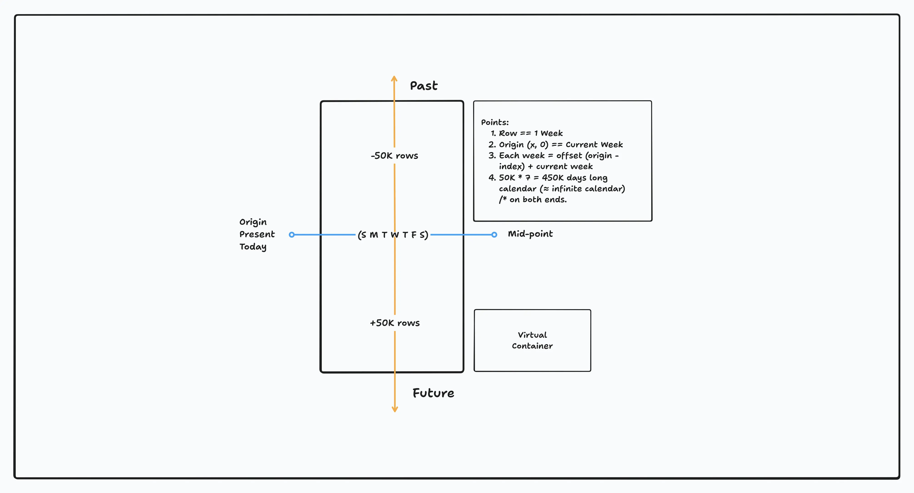

# Infinite Scrollable Journal Calendar

An infinite-scrolling calendar built with **Next.js**, **TypeScript**, **Tailwind CSS**, and **react-window** for smooth, virtualized week-by-week rendering. Users can view journal entries attached to dates, scroll seamlessly into the past and future, and interact with entries in a swipeable card interface.

---

## Tech Stack

* [Next.js (App Router)](https://nextjs.org/docs/app)
* [TypeScript](https://www.typescriptlang.org/)
* [Tailwind CSS](https://tailwindcss.com/)
* [date-fns](https://date-fns.org/)
* [react-virtuoso](https://virtuoso.dev/)
* [Embla Carousel](https://www.embla-carousel.com/)

---

## Getting Started

```bash
# Install dependencies
bun install

# Start development server
bun dev

# Build for production
bun build
```

The app will be available at [http://localhost:3000](http://localhost:3000).

---

## Assumptions

1. I've tried to mimic the features shown in the video provided with the assignment.
1. Based on the video and the assignment details, the main focus was on creating an infinitely smooth calendar and a post carousel.
1. I've ignored the bottom navigation bar and any other additional features or implementations.
1. I've aimed to make the UI sufficiently similar to the video for functional purposes. However, I've not focused on "pixel-perfection" due to the lack of design resources.
1. I've concentrated on implementing the two main elements—calendar and carousel—with utmost care.

---

## Design Choices

1. **Modal**
   I've built a custom modal API using the `createContext` hook in React.

   * It exposes only two functions: `openModal` and `closeModal`.
   * The modal can also be closed by pressing the `Esc` key.

2. **Carousel**
   For the swipeable card UI, I've used [`Embla Carousel`](https://www.embla-carousel.com/).

   * Active cards are scaled just like in the video.
   * Cards are responsive and adapt to different screen sizes.

3. **Calendar**
   The calendar follows a week-based rendering strategy, and to maximize the scrolling experience, I've used the [`react-virtuoso`](https://virtuoso.dev/) virtualized list library.

   * Refer to the section below for a more in-depth explanation of the rendering strategy.
   * Indexes are used to render past and future weeks.
   * Ranges are used to display the current month.
   * *To handle the header and first-block overlapping issue, always use the `start_index - 1` index.*

4. **UI**

   * I've utilized the [Month-view Calendar](https://tailwindcss.com/plus/ui-blocks/application-ui/data-display/calendars#component-c29139529079ea762f118812bbeaeb9e-dark) from the Tailwind components library.
   * The rest of the UI is custom-built.

---

## Trick for ≈ infinite calendar



For this task, I wanted to experiment with virtual lists and on-demand week data generation. The image shows the intuition behind the trick I used to render (almost) infinite months on the calendar. I broke it into two parts — let’s talk about both.

1. **Only Future**
   At first, I thought about how to generate future months. This can be done by adding subsequent weeks to the current week. (Here, the `date-fns` library helped a lot by handling edge cases for calendar days.) For example:

   ```md
   Current Week + 1 Week = Next Week
   Current Week + 2 Weeks = Second Week in the Future
   ...
   and so on.

   Broadly,
   Current Week + n Weeks = nth Week in the Future
   ```

   For a continuous calendar, we don’t need to worry about month padding. All we need to do is calculate the nth week in the future that’s requested for rendering.

   In this case, I used the `react-virtuoso` feature that returns the index of the row being rendered on the screen. We can use this index directly to calculate the week needed. This way, we can render (almost) infinite months into the future.

2. **Past as Well**
   Rendering past months was more challenging. For some reason, binary search kept coming to mind — so I thought, why not start in the middle and expand in both directions?

   By splitting the rows into two parts, the upper part represents past weeks and the lower part represents future weeks, with the current week in the middle (see the image). We can then reuse the previous technique to calculate weeks.

   However, doing this in `react-virtuoso` was tricky, since it only counts rows from zero up to the total row count. To solve this, I chose the middle (`total_row_count / 2`) as the starting point, scrolled to it [initially](https://virtuoso.dev/initial-index/), and then computed weeks relative to it. The offset is simply `(middle - row_index)`. The sign of the offset tells us whether to add weeks (future) or subtract weeks (past).

**In conclusion:** we can treat the middle as the origin, calculate offsets on both sides, and then decide based on the sign whether to move forward (future) or backward (past).

Now, how do we calculate the active month for the header? For this, I found a handy callback prop in the `react-virtuoso` component: [`rangeChanged`](https://virtuoso.dev/range-change-callback/). It provides the `startIndex` and `endIndex` of the currently rendered range (i.e., the weeks being displayed).

I simply take the mean of these two values and use it to calculate the offset week, which in turn determines the active month and year.

And voila! ✨

---

### Assignment Tasks Checklist

***

### Calendar Functionality
- [x] Implement **infinite past/future scroll** (used `virtuoso`).
- [x] Ensure **continuous scroll** — not snap-to-month.
- [x] Support **partial visibility of two months** in viewport.
- [x] Sticky header updates to show the **month with most visible area**.
- [x] Implement seamless loading of new months without flicker or jumps.
- [x] Build **custom calendar components** (`CalendarCell`, `CalendarRow`, `CalendarTable`) with Tailwind.

***

### Journal Entries
- [x] Parse and normalize dataset into ISO dates.
- [x] Render journal entries inside **calendar cells**.
- [x] On click, open **swipable card detail UI** (EntryCarousel).
- [x] Implement prev/next navigation between entries.
- [x] Ensure all provided journal entry data (image, rating, categories, date, description) is displayed correctly.

***

### UI & UX
- [x] Add **responsive design** (desktop + mobile grid).
- [x] Implement **sticky month header**.

***

### Performance
- [x] Virtualize rows (weeks) with `react-virtuoso` to reduce DOM nodes.
- [x] Compute week rows on the fly.
- [x] Optimize images with `next/image` (lazy loading).

***

### Deployment
- [x] Configure Next.js image domains for journal images.
- [x] Deploy to **Vercel**.
- [x] Connect GitHub repo → Vercel for preview deployments.
- [x] Add final README and documentation.

***

### Bonus Tasks

- [x] Animate the month header when it changes.
- [x] Use TypeScript throughout the project.
- [x] Add keyboard navigation (arrow keys to move between months).
- [ ] ~~Add event search or filtering functionality.~~

***

### Constraints
- [x] Do not use any library that provides a ready-made calendar component.
- [ ] Do not use AI-generated code.
- [x] Submit both the live URL and the GitHub repo link.

---

## Creator

- [Ashish Khare](https://ashishk1331.vercel.app/)